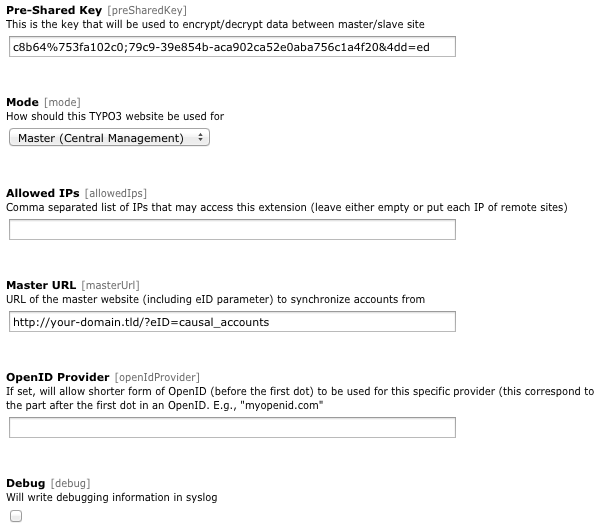

.. ==================================================
.. FOR YOUR INFORMATION
.. --------------------------------------------------
.. -*- coding: utf-8 -*- with BOM.

.. include:: ../../Includes.txt

.. _install-extension:

Installing the extension
------------------------

There are a few steps necessary to install the Central Account Management extension. If you have installed other
extensions in the past, you will run into little new here.

Install the extension from Extension Manager
^^^^^^^^^^^^^^^^^^^^^^^^^^^^^^^^^^^^^^^^^^^^

The Central Account Management extension can ben installed through the typical TYPO3 installation process using the
Extension Manager.

During the installation process, you may be invited to install the system extension "openid" if you did not load it
already. If so, just proceed as usual (the openid system extension basically just needs a few additional fields to be
present for frontend and backend user tables).

	The various configuration options in Extension Manager.

.. _configure-master:

Configure the extension for the master website
^^^^^^^^^^^^^^^^^^^^^^^^^^^^^^^^^^^^^^^^^^^^^^

- Choose a pre-shared key from any length

- Make sure the mode is set to  **Master (Central Management)**

- (optional) Specify the list of IPs (remote servers) allowed to connect to this master server. They should be separated
  by commas

- (optional) Activate the debugging information. This will allow you to get the list of remote site trying to connect to
  the master, along with their IP. The information will be sent to the TYPO3 system log.

.. _configure-remote:

Configure the extension for a remote website
^^^^^^^^^^^^^^^^^^^^^^^^^^^^^^^^^^^^^^^^^^^^

- Enter the pre-shared key you chose for the master website

- Make sure the mode is set to  **Slave (Remote site)**

- Specify the master website URL. If you master website is http://www.mycompany.org, then the master website URL is
  http://www.mycompany.org/?eID=causal\_accounts

- (optional) Configure short OpenID authentication. This allows users to authenticate with a shorter form of their
  OpenID. For example if most of your users own an OpenID on myopenid.com, you may allow them to authenticate with
  ``<username>`` solely instead of ``<username>.myopenid.com``. For this, just specify "myopenid.com" as OpenID
  provider. If some of your users do not use the specified OpenID provider, they will still be able to authenticate
  using the full form of their OpenID, namely ``<username>.some-other-provider.tld``.

  .. figure:: ../../Images/authentication-openid.png
  	:alt: Backend authentication with OpenID

  	Backend authentication login form using OpenID.

- Open the scheduler module and create a new task “Account synchronization” and configure it to be run regularly

- (optional) Manually run it once to perform the initial synchronization. You may of course wait until it run itself as
  configured

Possible synchronization errors will be sent to the TYPO3 system log regardless of the debugging flag set in the
configuration options.
