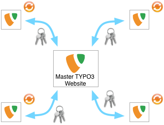

.. ==================================================
.. FOR YOUR INFORMATION
.. --------------------------------------------------
.. -*- coding: utf-8 -*- with BOM.

.. include:: ../Includes.txt

.. _introduction:

Introduction
============

.. _what-it-does:

What does it do?
----------------

This extension allows a TYPO3 website to be used as a central Backend user management system and synchronize its
administrators to remote websites (typically from customers). Administrators will be synchronized with their settings
(name, email address, TSconfig), allowing them to feel comfortable in any remote websites. Their status
(active/inactive) will be synchronized as well, allowing the central management website to quickly and easily disable
any administrator from being granted access to the remote websites.

This extension requires the system extension “openid” to be loaded both on master and on remote websites. Furthermore,
it will generates a random password on the remote websites, thus forcing the use of OpenID as authentication mechanism.

.. _how-does-it-work:

How does it work?
-----------------

A scheduler task is provided for the remote sites. This task should be run regularly, for instance once a day. It
connects to the master website and retrieve the list of administrator accounts (without the encrypted passwords which
are not needed anyway) as an encrypted JSON feed. The feed is encrypted using a pre-shared key. This is a security
layer which acts more as a simple barrier to avoid administrators email addresses to be available for anybody. In
addition to this security layer, the master may be configured from within the extension to only allow a given set of
remote servers to connect to it.

The random generated password for synchronized accounts on the remote sites is compatible with the system extension
"saltedpasswords" in order to prevent the TYPO3 reports to show warnings that synchronized accounts do not use salted
passwords. If salted passwords are not used, then the random password will be hashed as md5, as usual.

The administrator data is encrypted using the Advanced Encryption Standard (AES) with a key size of 256 bits. Standard
PHP methods :php:`mcrypt_encrypt()` and :php:`mcrypt_decrypt()` are used with the mode of operation Cipher-block
chaining (CBC).

	Overview of the synchronization mechanism between a master TYPO3 website and remote (slave) websites.

.. _sponsorship:

Sponsorship
-----------

This extension has originally been developped for and sponsored by hemmer.ch SA, a swiss company of TYPO3 integrators.

Further information:

- hemmer.ch SA: http://www.hemmer.ch/
- Causal Sàrl: https://www.causal.ch/
